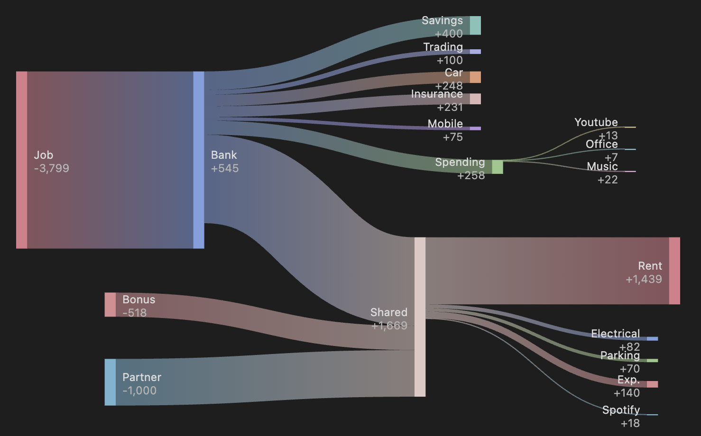
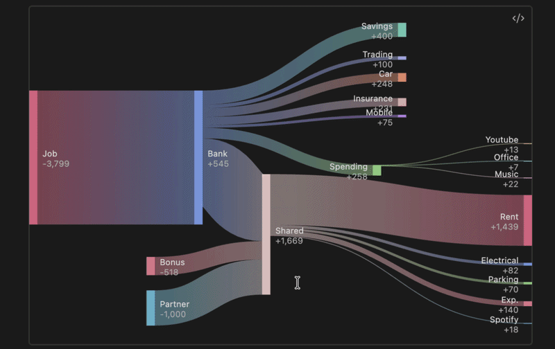

# FINKEY

Create beautiful and interactive sankey diagrams right in your notes.



Tired of sankey generators putting nodes out of order? Drag and drop them back in position or disable the automatic alignment altogether.



See the flow on hover and instantly understand how much is left in each node.

## Usage
Start a codeblock with ```finkey (lowercase)

If the relaxation algorithm is disabled via plugin settings, Finkey will respect the order the nodes appear in the codeblock.
```
```finkey

Node A -> Node B : 50

// this is a comment

Node A -> Node C : 100
Node C -> Node 1 : 20
Node C -> Node 2 : 30

// @positions: Here will be some positional logic generated by Finkey. Can be deleted to reset the layout.
```


---
Palette by ❤️ [Catppuccin](https://github.com/catppuccin/catppuccin) 
